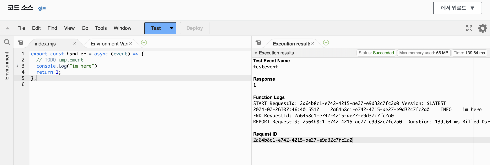
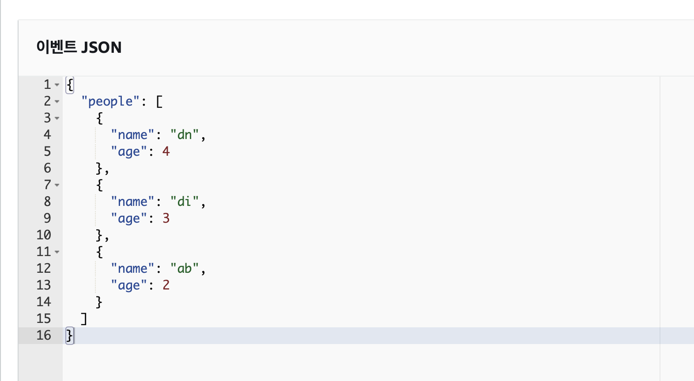
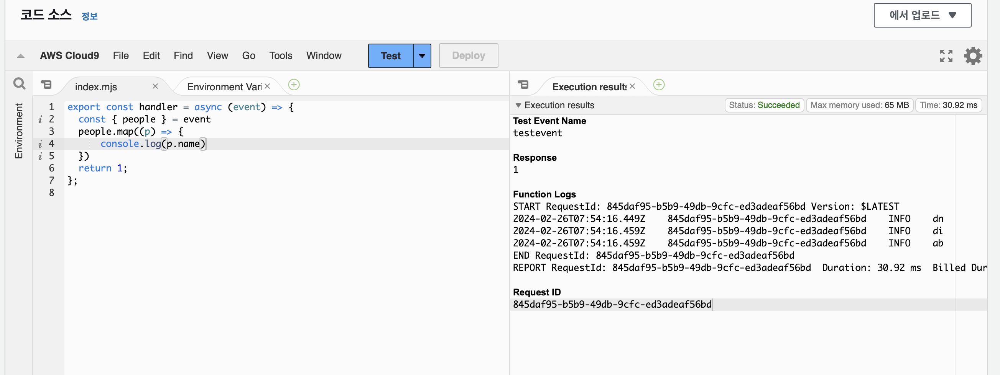
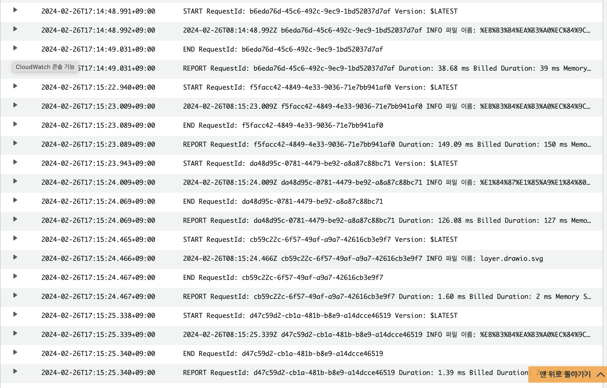

## Lambda

AWS Lambda는 0.1초 단위 컴퓨터 임대 서비스 입니다.

Lambda의 기본 단위는 함수 입니다.

- Lambda : Function
- EC2 : Instance
- S3 : Bucket

### 생성

- [AWS Lambda](https://ap-southeast-2.console.aws.amazon.com/lambda/home?region=ap-southeast-2#/begin)

1. 함수 생성
2. 함수 이름, 런타임 설정

### 실행

1. 코드 작성
   1. deploy, Test 실행
   2. 테스트 이벤트 이름, 이벤트 JSON 설정
2. 결과 확인

### 디버깅

모니터링 > CloudWatchLogs 보기 > 로그 스트림에서 람다에 대한 디버깅이 가능하다.

### 이벤트 JSON 수정

- 테스트 > 이벤트 JSON 수정 > 저장

### 트리거

1. 예제용 S3 버킷 생성(버킷에 파일 업로드시 람다 실행)
2. 버킷 선택, 이벤트 선택, 추가
3. S3에 선택 이벤트 발생시 람다 실행

> CloudWatch 기록

람다에서 파라미터로 s3에서 발생한 이벤트의 정보를 넘겨준다.

이를 이용하여 작업이 가능하다.
