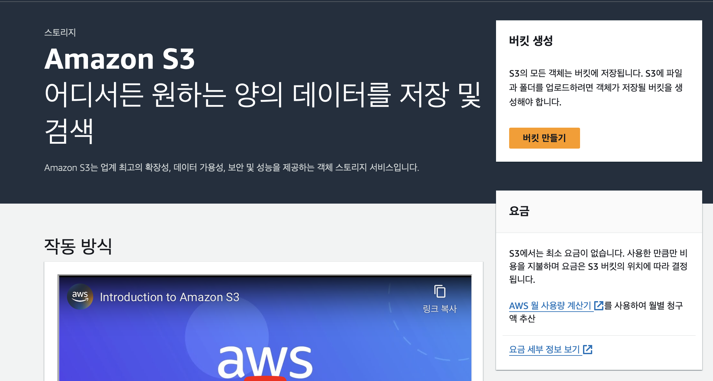
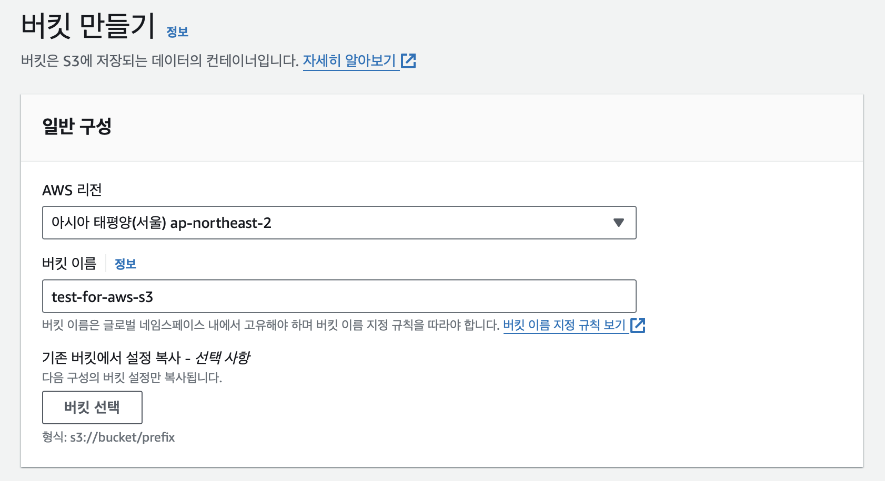
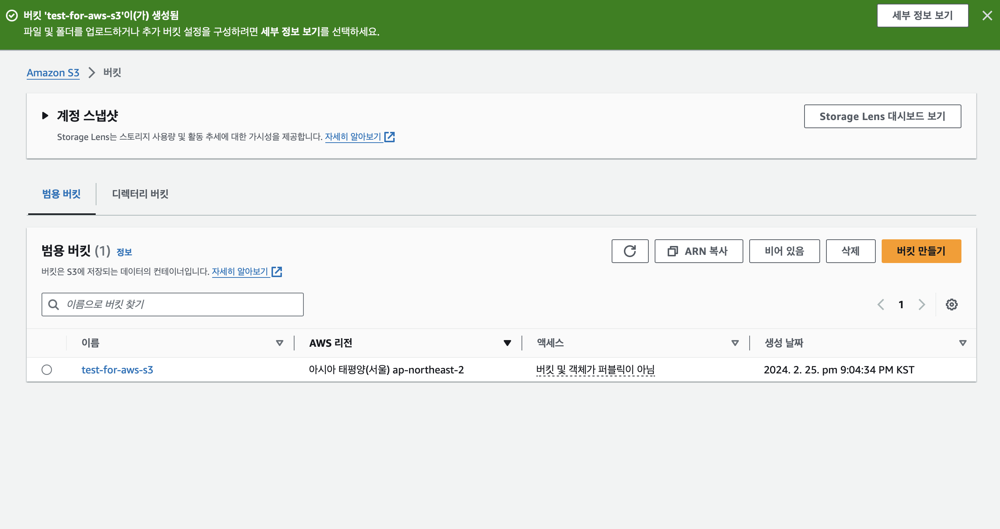
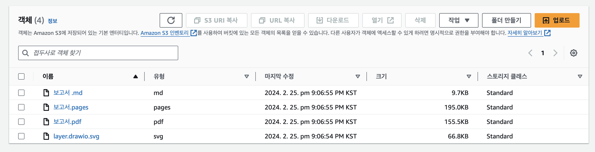
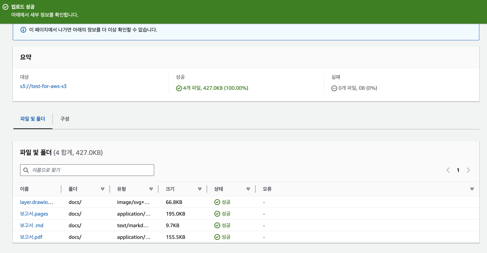
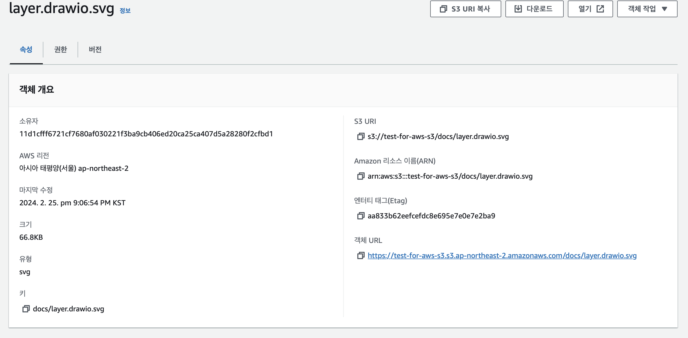
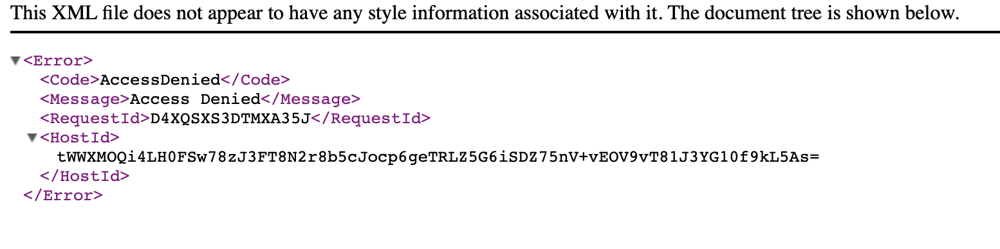
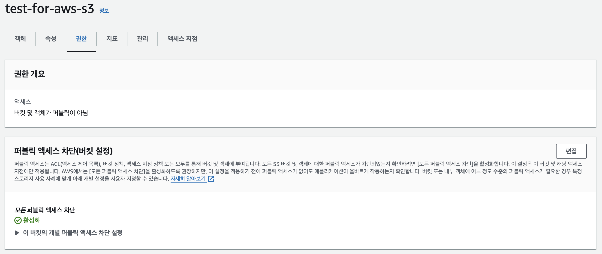
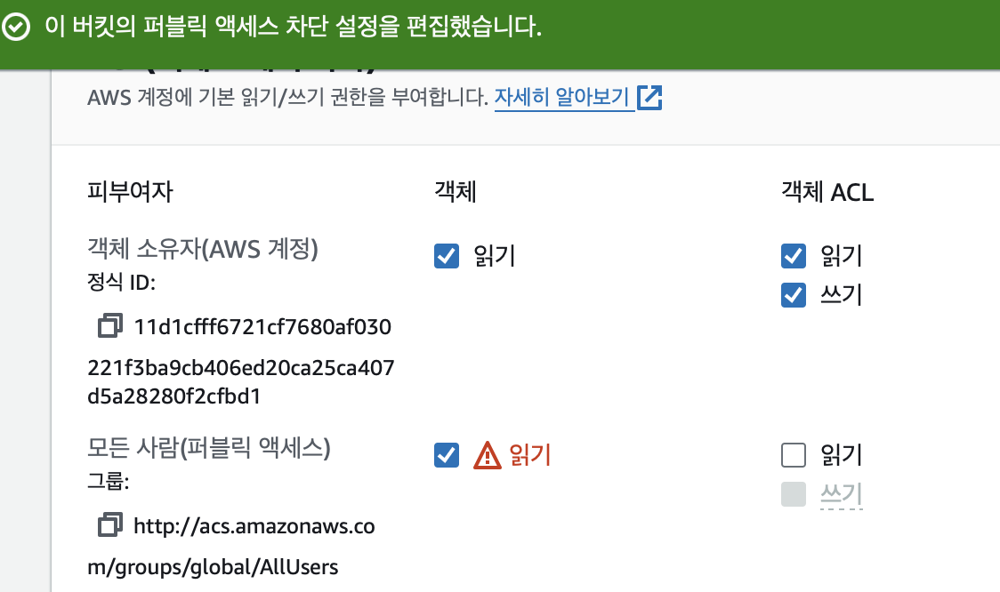

## S3

AWS S3는 파일 저장을 제공한다.

### 구성 요소

- bucket
- folder
- Object(파일)

bucket > folder > Object 순서로 구성되어 있다.

### 버킷 생성

1. S3 홈페이지 접속

2. 버킷 이름 설정

3. 버킷 생성

### 객체 파일

1. 버킷을 클릭하고 폴더를 드래그 & 드롭

2. 폴더 업로드 완료

### 공유와 권한

1. 올린파일의 접근 링크 클릭

2. 접근 권한이 없어 실패한다.

3. 버킷의 권한 변경

4. 파일의 권한 변경

### 스토리지 클래스

S3의 스토리지 클래스는 여러 종류의 스토리지를 지원한다. 데이터의 성격에 따라 적절한 클래스를 선택, 사용한다.

- [aws s3 storage class](https://docs.aws.amazon.com/ko_kr/AmazonS3/latest/userguide/storage-class-intro.html)

### 언어를 이용한 조작

aws sdk는 여러 종류의 프로그래밍 언어를 이용해 S3와 같은 aws 서비스를 조작할 수 있다.

또한 CLI를 통한 조작도 가능합니다.

- [npm aws sdk](https://www.npmjs.com/package/aws-sdk)
