# 데이터베이스 기본

## 데이터베이스와 응용프로그램간 관계

## 엔티티와 엔티티 인스턴스

엔티티와 엔티티 인스턴스의 관계는 아래 그림과 같습니다.

### 엔티티와 테이블 관계

|   엔티티   |      테이블      |
| :--------: | :--------------: |
|   엔티티   |      테이블      |
|    속성    |  컬럼, 열, 필드  |
|  인스턴스  | 튜플, 행, 레크드 |
|  주식별자  |     기본 키      |
| 외래식별자 |     외래 키      |

### 엔티티

엔티티는 여러개의 속성을 가진 명사입니다.

엔티티의 속성은 필요한 정보에 따라 적절히 추상화됩니다.

#### 릴레이션

릴레이션은 정보를 구분하여 저장하는 단위입니다.

#### 속성

속성은 엔티티를 구성하는 정보단위입니다.

물리적 데이터베이스 설계시 필드가 되며, 필드는 타입을 가지게 됩니다.

### 강한 엔티티

강한 엔티티는 다른 엔티티에 종속적이지 않으며, 혼자서 존재가 가능합니다.

### 약한 엔티티

약한 엔티티는 종속적이며, 혼자서 존재가 불가능합니다.

## MySQL의 필드

|   타입    | 종류                                                |
| :-------: | :-------------------------------------------------- |
| 숫자 타입 | `TINYINT`, `SMALLINT`, `MIDEUMINT`, `INT`, `BIGINT` |
| 날짜 타입 | `DATE`, `DATETIME`, `TIMESTAMP`                     |
| 문자 타입 | `CHAR`, `VARCHAR`, `TEXT`, `BLOB`, `ENUM`, `SET`    |

## N 대 M 관계

N 대 M 관계는 1 대 N, 1 대 M 관계로 나누어 처리합니다.

## 키

테이블간의 관계를 설정하기 위해 필요합니다. 기본키, 외래키, 후보키, 슈퍼키, 대체키가 있습니다.

### 기본키

기본키(PK)는 유일성과 최소성을 만족시키는 키입니다. 다중 속성 기본키도 가능합니다.

- 유일성: 중복이 없음
- 최소성: 필드의 조합을 최소한으로 사용

#### 자연키 인조키

- 자연키: 특정 속성에서 자연스럽게 나오는 키
- 인조키: 인위적으로 만든 식별자

### 외래키

외래키는 다른 테이블의 기본키를 참조하는 속성, join을 위해 사용합니다.

### 후보키

기본키가 될 수 있는 키입니다.

### 슈퍼키

각 레코드를 유일하게 식별할 수 있는 유일성을 갖춘 키입니다.

### 대체키

후보키가 여러 개일 때 기본 키를 제외한 나머지 후보키입니다.
