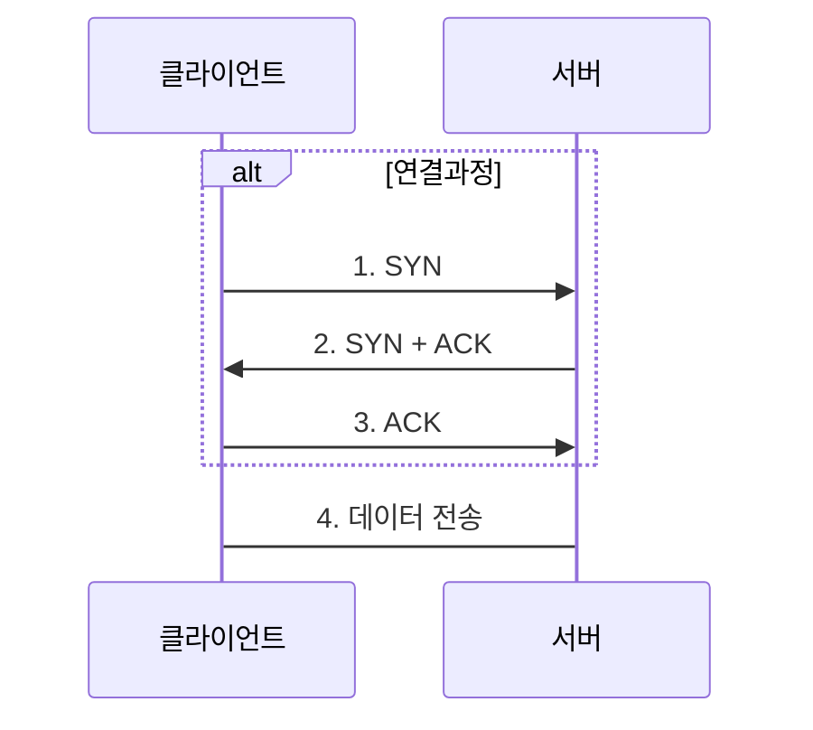

## 인터넷 네트워크

### IP (Internet Protocol)

인터넷 네트워크에서 하나의 컴퓨터에 할당되고 패킷을 통해 서로 통신하며 정보를 교환 패킷에는 출발지 도착지 IP 정보가 있음

패킷은 인터넷 네트워크에 있는 각 노드를 통해 목적지 까지 전송됨

#### IP 프로토콜의 한계

- 비연결성: 대상이 없거나 오프라인 상태라도 패킷을 전송함(대상이 서비스 불능 상태여도 패킷 전송)
- 비신뢰성: 인터넷 네트워크에서 패킷 전송중 사라지거나(패킷 소실) 패킷이 순서대로 안 올 수 있음
- 프로그램 구분: 하나의 컴퓨터에 여러 프로그램이 인터넷에 연결되어 통신을 해야함 (패킷 전달 순서 문제 발생)

### TCP(Transmission Control Protocol)

- 연결 지향
  - TCP 3way handshake
- 데이터 전달 보증
- 순서 보장
  - 패킷에 순서 정보가 있음

신뢰할 수 있는 프로토콜로 대부분 TCP를 사용한다.

#### TCP 3way handshake

### UDP(User Datagram Protocol)

기능이 거의 없어 단순하고 빠르지만 TCP의 전달, 순서 보장이 안됨 IP + port + 체크섬 정도로 어플리케이션에서 추가 작업이 필요함

### PORT

하나의 컴퓨터에서 여러 프로그램이 동시에 인터넷 네트워크를 사용한다. port는 인터넷 네트워크와 연결된 프로그램을 구분할 수 있는 번호다.

0 ~ 65535까지 있고 0 ~ 1024는 잘 알려진 포트라고 하고 사용하지 않는 것이 좋다.

### DNS(Domain Name System)

네이버에 접속할 때 네이버 서버의 IP를 몰라도 www.naver.com을 주소창에 입력하면 네이버 서버와 접속이 가능하다.

DNS는 www.naver.com에 대해 조회하면 www.naver.com에 맞는 IP 주소를 반환해 주는 시스템이다.

그러면 접속하는 컴퓨터는 해당 IP를 가지고 접속한다.
