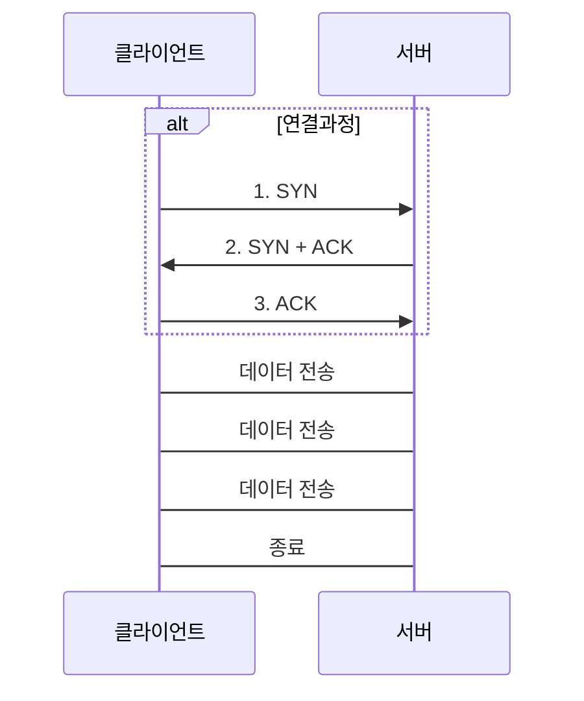

## HTTP 기본

### HTTP 역사

- 1997 HTTP/1.1 가장 많이 사용
- 2015 HTTP/2 성능 개선
- 2022 HTTP/3 UDP 사용, 성능 개선

### 무상태 프로토콜

무상태(Stateless)는 서버에 클라이언트에 대한 상태가 없는것을 말함, 스케일 아웃으로 편하게 확장 가능하지만 추가 데이터 전송이 필요함

### Stateful, Stateless 차이

#### Stateful

다른 프로세스로 변경되면 안됨, 변경되더라도 클라이언트의 상태를 다른 프로세스가 확인 가능하게 해야 함

#### Stateless

- 클라이언트가 필요한 정보를 다 제공하기 때문에 중간에 다른 프로세스로 변경되어도 처리에 문제가 없음
- 클라이언트의 요청이 증가하면 스케일 아웃으로 편하게 서버 확장 가능
- 무상태로 설계할 수 있는게 있고 없는게 있으므로 상태유지는 최소한으로 사용(세션, 쿠키)

### 비 연결성(connectionless)

- 클라이언트와 서버가 연결을 계속 유지할 필요는 없음(리소스 낭비)
- HTTP는 기본으로 연결을 유지 안함
- 매번 3way handshake를 해야 하는 문제점이 있었고 HTTP 지속 연결(Persistent Connections)로 해결
- HTTP/2, HTTP/3에서 더 많은 최적화가 이루어짐

#### 지속연결



### HTTP 메시지

- 시작라인(start-line): 메소드, 요청대상, HTTP 버전
- 헤더: HTTP 전송에 필요한 모든 부가정보
- 공백라인
- 본문(body): 실제 전송 데이터

#### 요청 메시지

```text
POST /login HTTP/1.1        // 시작라인
Host: www.example.com       // 헤더
Content-Type: application/x-www-form-urlencoded
Content-Length: 27
                            // 공백라인
username=user&password=pass // 본문
```

#### 응답 메시지

```text
HTTP/1.1 200 OK             // 시작라인
Date: Mon, 06 Aug 2024 12:34:56 GMT
Server: Apache/2.4.41 (Ubuntu)
Last-Modified: Mon, 06 Aug 2024 10:00:00 GMT
Content-Type: text/html     // 헤더
Content-Length: 305
                            // 공백라인
<!DOCTYPE html>             // 본문
<html>
<head>
    <title>Example Page</title>
</head>
<body>
    <h1>Welcome to Example Page</h1>
    <p>This is an example of an HTTP response.</p>
</body>
</html>
```
