## 자바 컴파일 과정

대부분의 프로그래밍 언어는 텍스트로 된 파일로 실행할 수 없어 컴파일 과정을 거친다.



## 자바의 자료형

기본 자료형과 참조 자료형 구분은 `new` 의 사용 여부에 따라 참조인지 기본 자료형인지 결정된다.

### 기본 타입

- 정수: `byte`, `short`, `int`, `long`, `char`
- 소수: `float`, `double`
- 불리언: `boolean`

#### int, long 타입 형 변환

long 타입의 뒤에는 L을 붙여야 한다. L을 붙이지 않으면 정수로 판단한다. int의 범위를 넘으면 문제가 발생한다.

- float: 부호(1bit) + 지수(8bit) + 가수(23bit) = 32bit
- double: 부호(1bit) + 지수(11bit) + 가수(52bit) = 64bit

- char: 유니코드, 아스키 코드를 받아 문자를 문자를 처리한다.

기본 자료형 전부 기본값을 초기화하지 않으면 전부 0으로 처리한다. (char:/u0000, boolean: false)

## 동등 비교 연산

참조 자료형은 주소 값이 같은지 확인한다.

## 기본 생성자

자바는 생성자를 만들지 않아도 자동으로 만들어지는 기본 생성자가 있다.

`main()`의 클래스이다. 다른 생성자가 없으면 컴파일 시점에 의해 만들어진다.

## static

static은 어떤 클래스의 객체가 생성되면서 한 번만 호출되어야 하는 코드가 있다면 static 블록을 사용할 수 있다.

static 블록은 객체가 생성되기 전에 한 번만 호출될 수 있다. 이후에는 호출이 불가능해진다.

## pass by value, pass by reference

- 기본 자료형: pass by value (단 String은 내부적으로 new를 사용한 것과 같다.)
- 참조 자료형: pass by reference

## 임의 개수의 매개변수를 받는법

`함수(타입...변수명)`으로 길이가 가변적인 매개변수를 받을 수 있다.
`함수(boolean b, int...numbers)`과 같이 받을 수 있다.

## 패키지

자바는 컴파일 시 해당 패키지의 가장 상위 디렉터리에서 실행해야 한다.

### 패키지 이름 지정 방법

| 키워드 |         의미         |
| :----: | :------------------: |
|  java  |   자바 기본 패키지   |
| javax  |   자바 확장 패키지   |
|  org   | 비영리 단체의 패키지 |
|  com   |  영리 단체의 패키지  |

- 패키지의 이름이 앞에 java가 사용 불가능
- 패키지 이름은 모두 소문자
- 자바의 예약어 사용 금지

## import

import ~.* 는 패키지의 모든 클래스를 임포트한다. 하위 패키지의 클래스를 모두 임포트하지 않는다.

### import static

import static은 static 변수, 메소드만 가지고 온다.

java.lang 패키지는 import할 필요가 없다.

## 접근 지정자

package-private, 접근 지정자를 적어주지 않으면 package-private 접근 지정자를 가지게 되고, 같은 패키지에서만 접근이 가능하다.

접근 지정자는 클래스 인스턴스 변수, 클래스 변수에 적용할 수 있다.

## 상속

extends는 하나의 클래스만 가능하다. (단일 상속)

### 상속의 조건

1. 상속을 통한 부모의 메소드를 사용하게 되면 부모의 클래스의 기본 생성자가 있어야 한다.
2. 익스텐즈 되어 있는 상태여야 한다.
3. 자식 클래스에 생성자가 호출되면 부모 클래스의 매개 변수에 없는 매개 변수 없는 생성자 함수가 실행된다.
4. 부모 클래스의 변수 메서드를 사용 가능해진다.

`super()` 자바에서 super는 부모 클래스의 생성자를 호출한다.

`super.메서드 명`과 같이 사용할 수 있다. 자식 클래스의 생성자 함수에서는 자식 클래스를 컴파일 할 때 `super()`라는 문장이 들어간다.
매개 변수가 없는 생성자 함수가 부모 클래스에서 존재하지 않는다면 `super(매개 변수)`로 사용할 수 있다.

정리하면 클래스에 매개 변수가 있는 생성자 함수만 있는 경우 `super()`를 이용해야 한다.

자식 클래스에 `super()`를 명시적으로 지정하지 않으면 컴파일에서 자동으로 `super()`가 추가된다.

그리고 `super`는 반드시 자식 클래스의 생성자에서 가장 맨 첫 줄에 선언되어야 한다.

## 시그니처

시그니처는 메소드의 이름과 매개 변수, 타입, 개수 등을 의미한다.

### 오버라이딩 정리

메소드 오버라이딩은 부모 클래스의 메소드와 동일한 시그니처를 갖는 자식 클래스의 메소드가 존재할 때 성립된다.

- 오버라이딩된 메소드는 부모 클래스와 동일한 리턴 타입
- 접근 권한은 자식 클래스가 같거나 확장된 상태여야 함(protect -> public, public -> public)

## 참조 자료형 형 변환

자식 타입은 부모 타입으로 형 변환이 가능하다. (자동)

부모 타입을 자식 타입으로 변환하면 명시적 타입 지정이 필요하다. 이때 부모 타입의 실체가 자식 타입이어야 한다.

```java
// p는 Child클래스의 인스턴스 이지만 Parent클래스로 형 변환이 가능하다.
Parent p = new Child()
// Child타입으로 타입 캐스팅 하는 경우 p는 사실 Child 타입이여야한다.
Child c = (Child) p
```
