# 함수

## 함수의 기본 구조

```js
// 매개 변수 => x, y
function add (x, y) {
    return x + y;
}

// 인수 => 1, 2
add(1, 2)
```

## 함수 정의

자바스크립트 엔진은 평가시점에 함수선언문의 식별자가 암묵적으로 등록 및 생성되고 함수 객체가 할당됩니다.

자바스크립트 엔진은 함수 선언문이 평가되면 식별자가 암묵적으로 생성되고 함수 객체가 할당됩니다.



### 함수 선언문

```js
function add (x, y) {
    return x + y;
}
```

- 이름 생략 불가능
- 표현식이 아닌 문
- 함수 호이스팅 발생

### 함수 표현식

```js
var add = function (x, y) {
    return x + y;
}
```

- 이름 생략 가능
- 변수 호이스팅 발생

### 함수 호이스팅

함수 호이스팅은 함수가 런타임 이전(평가 시점)에 값 할당까지 완료되어 함수 선언문 이전에 호출할 수 있는 것을 말합니다. 변수 호이스팅과는 다릅니다.

함수 선언문은 함수 호이스팅이 발생하고 함수 표현식은 변수 호이스팅이 발생합니다.

함수 선언문과 함수 표현식의 생성 시점이 다릅니다. 함수 선언문은 런타임 이전(평가 시점)에 자바스크립트 엔진이 암묵적으로 함수 식별자로 변수를 생성하고 함수 객체 생성 및 할당을 진행합니다.

함수 표현식은 런타임 이전(평가 시점)에 변수 호이스팅이 발생하고 런타임에 함수 객체를 할당합니다.

## 함수에서 인수의 객체 변경 시 문제점

함수 외부에서 함수 내부로 전달한 객체를 함수 내부에서 변경하면 함수 외부의 객체가 같이 변경되는 부수 효과가 발생합니다.

[객체 전달 방식](<원시값, 객체 전달.md#객체>)

## 순수 함수 비 순수 함수

### 순수 함수

- 동일한 인수가 전달되면 언제나 동일한 값을 반환
- 인수의 불변성을 유지
- 외부 상태를 변경하지 않음

### 비 순수 함수

- 함수의 외부 상태에 따라 반환값이 달라지는 함수
- 외부 상태를 변경하는 부수 효과 발생
