## 스프링 웹 개발 기초

- 정적 컨텐츠(단순 파일 서빙)
- MVC 템플릿 엔진(클라이언트 요청에 맞게 html 변환 후 서빙)
- API(클라이언트 요청에 맞는 데이터 전달)

### 정적 컨텐츠



### MVC 템플릿 엔진


### API



#### 문자열 반환

```java
@Controller
public class HelloController {
    @GetMapping("hello")
    @ResponseBody
    public String helloString(@RequestParam("name") String name) {
        return "hello " + name;
    }
}
```

#### 객체 반환

```java
@Controller
public class HelloController {
     
    @GetMapping("hello")
    @ResponseBody
    public Hello helloApi(@RequestParam("name") String name) {
        Hello hello = new Hello();
        hello.setName(name);
        return hello;
    }

    static class Hello {
        private String name;
    
        public String getName() {
            return name;
        }
        
        public void setName(String name) {
            this.name = name;
        } 
    }
}
```

- 컨트롤러 메서드에 `@ResponseBody`를 붙여줘야 한다. (http에 직접 데이터를 작성을 의미)
- `메서드_이름 (@RequestParam(문자열) 타입 인수)`를 통해 클라이언트가 url 파라미터로 보낸 데이터를 받을 수 있다.
- 컨트롤러 메서드의 반환 값은 문자열, 객체가 가능하고 객체를 전송하려면 해당 클래스를 만들어야 함
