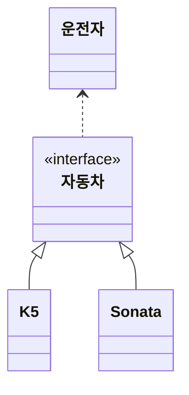

## 객체 지향 설계와 스프링

### 스프링 탄생 배경

당시 자바에서 EJB(Enterprise Java Beans)를 많이 사용했으나 복잡하고 어려우며 EJB에 의존적인 코드를 작성해야하는 문제점이 있었음

그래서 나온게 POJO였다.

> POJO(Plain Old Java Object)
>
> POJO는 순수한 자바 객체를 의미한다. EJB방식에 종속된 무거운 객체를 만드는 것에 반발하며 만들게 되었다.

### 스프링과 스프링 부트

- 스프링은 DI 컨테이너, AOP 등을 지원한다.
- 스프링 부트는 스프링 + 스프링 프로젝트에 필요한 설정, 외부 라이브러리다.

### 스프링의 핵심

좋은 객체지향 프로그래밍을 할 수 있도록 도와주는 프레임워크다.

### 좋은 객체 지향 프로그래밍

- 추상화
- 캡슐화
- 상속
- 다형성
  - 변경에 유연하게 대처할 수 있다.
  - 부품을 갈아끼우듯 변경이 간단하다.

### 다형성의 실세계 비유

역할(인터페이스)과 구현(구현 클래스)으로 세상을 구분



- 자동차가 변경되어도 운전자에게 영향이 없다.
- 운전자가 구현이 아닌 역할 (인터페이스에 의존함으로서 구현에서 새로 추가되어도 운전자에게 영향을 받지 않음)
- 운전자는 자동차의 내부를 몰라도 된다.
- 역할과 구현을 분리하고 역할(인터페이스)를 먼저 부여하고 그 역할을 수행하는 객체로 만든다.

### 다형성의 본질

- 인터페이스를 구현한 객체 인스턴스는 실행시점에 변경 가능하다.
- 다형성의 본질은 객체사이의 **협력 관계(인터페이스)**에서 시작한다.
- 인터페이스를 유지하면 클라이언트의 변경없이 서버의 구현 기능을 유연하게 변경 가능하다.

### 역할과 구현을 분리

역할이 변경되면 클라이언트 서버 둘 다 큰 변경이 발생한다. 그래서 인터페이스를 잘 설계하는 것이 중요하다.

### 스프링과 객체지향

스프링은 DI, IoC를 통해 역할과 구현을 편리하게 다룰 수 있도록 지원한다.

### SOLID

좋은 객체지향 설계의 5가지 원칙

#### SRP 단일 책임 원칙(Single Responsibility Principle)

- 하나의 클래스는 하나의 책임만
- 변경이 있을때 파급효과가 적으면 단일 책임 원칙을 잘 따른 것이다.

#### OCP 개방 폐쇄 원칙(Open Closed Principle)

- 확장에는 열려있고 변경에는 닫혀있어야 한다.
- 다형성을 이용하면 기존코드(클라이언트)의 변경 없이 기능 확장이 가능하다.

##### 문제점

다형성을 사용해도 OCP를 위반할 수 있다.

```java
class Driver {
    Car car = new K5();
}
```

```java
class Driver {
    Car car = new Sonata();
}
```

구현 객체에 클라이언트 코드가 영향을 받는다.(Driver가 사용하는 인스턴스 변경을 하려면 클라이언트 코드를 수정해야 한다.)

다형성을 사용했으나 OCP원칙을 위반하고 기존코드(클라이언트)의 변경이 필요하다.

객체생성과 연관관계를 설정을 수행하는 무언가가 필요하다.

#### LSP 리스코프 치환 원칙(Liskov Substitution Principle)

다형성에서 하위 클래스는 인터페이스 규약을 다 지켜야한다.

> 예)어떤 키보드든 스페이스바를 눌렀을 때 공백을 입력해야 한다. 공백을 입력하지 않는다면 LSP위반이다. 즉 예상 가능하도록 구현해야한다.

#### ISP 인터페이스 분리 원칙(Interface Segregation Principle)

- 특정 클라이언트를 위한 인터페이스 여러개가 범용 인터페이스 하나보다 낫다.
- 범용 인터페이스에서 분리하면 분리된 인터페이스가 변경되도 다른 인터페이스는 영향이 없다.
  - 범용 인터페이스 A에서 B, C로 분리하고 C를 변경하면 B에는 영향이 없다.
- 인터페이스가 명확해지고 대체가능성이 높아진다. 큰 인터페이스보다 작은 인터페이스가 구현하기 쉽다.

#### DIP 의존관계 역전 원칙(Dependency Inversion Principle)

- 프로그래머는 추상화에 의존해야지 구체화에 의존하면 안된다.
- DIP원칙을 따르더라도 의존이 발생할 수 있다.

```java
class Driver {
    Car car = new K5();
}
```

```java
class Driver {
    Car car = new Sonata();
}
```

OCP에 코드를 보면 Car 인터페이스와 구현 클래스를 동시에 의존한다.

> 의존: 다른 클래스에 대한 정보를 알고있음

생성자, setter를 통한 의존성 주입으로 해결 가능하다. 이는 클라이언트 코드의 변경없이 기능 확장이 가능하다.

### 정리

- 모든 설계에 역할(인터페이스)과 구현(구현 클래스)을 분리한다. 이는 언제든지 유연하게 변경할수 있도록 한다.
- 객체지향의 핵심은 다형성이다.
- 다형성만으로는 OCP, DIP를 지킬수 없고 무언가가 더 필요하다.

#### 객체 지향 설계와 스프링

스프링은 아래 기술로 OCP, DIP를 가능하게 한다.

- DI(Dependency Injection) 의존관계, 의존성 주입
- DI 컨테이너

역할(인터페이스)과 구현을 나누되 인터페이스는 추상화라는 비용이 발생하게 된다. (내부 구현이 무엇인지 바로 알 수 없음 한 단계를 더 거쳐야 함) 그러므로 기능확장이 없다면 클래스를 사용하고 추후 기능확장이 있을 때 인터페이스를 사용한다.
