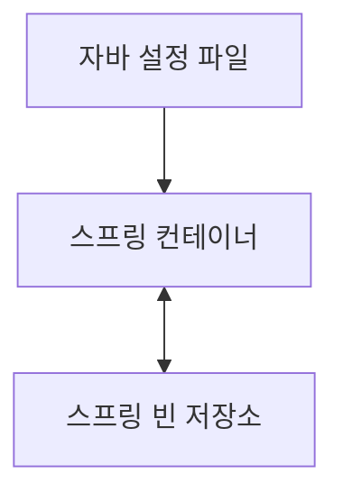
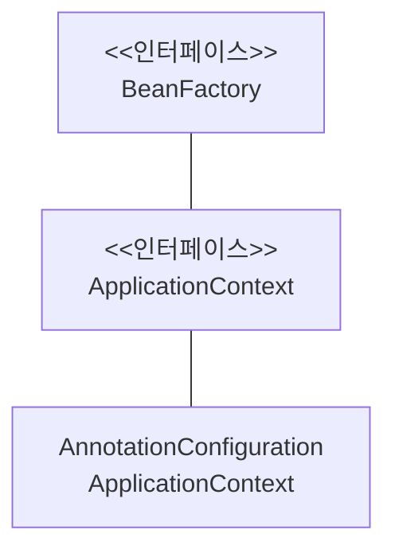
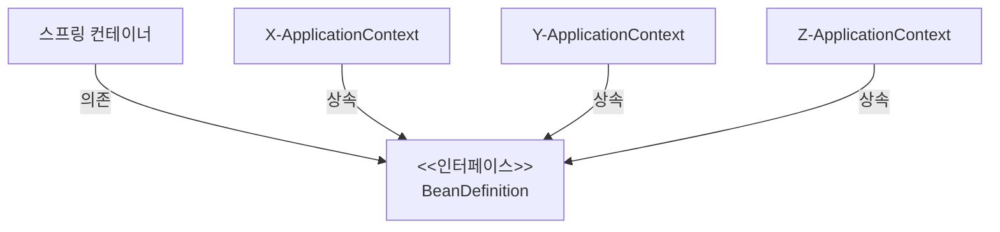

## 스프링 컨테이너와 스프링 빈

### 스프링 컨테이너 생성 과정



`new AnnotationConfigApplicationContext(Config.class)`에서 스프링은 Config.class의 구성 정보를 확인해 스프링 빈을 만든다.

1. 스프링이 자바 설정 파일의 정보를 가지고 옴
2. 스프링 컨테이너의 스프링 빈 저장소에 이름은 `메서드 이름`, 값은 `반환 객체`로 저장

빈 이름은 유일해야 한다.

기본적으로 메서드 이름을 빈 이름으로 사용하지만 `@Bean( name = "지정할 빈 이름" )`으로 따로 지정할 수 있다. 그러나 빈 이름의 중복으로 오류가 발생할 가능성이 있다.

별다른 설정을 하지 않은 빈 객체는 싱글톤으로 같은 객체를 공유한다.

### 스프링 컨테이너에서 빈 조회

#### 모든 빈 조회

```java
AnnotationConfigApplicationContext ac = new AnnotationConfigApplicationContext(Config.class);
```

모든 빈 출력

```java
String[] beanNames = ac.getBeanDefinitionNames();

for (String beanName : beanNames) {
    Object bean = ac.getBean(beanName);
    System.out.println("빈 이름: " + beanName + " 빈: " + bean);
}
```

- `ac.getBeanDefinitionNames();`으로 스프링 컨테이너에 있는 모든 빈의 이름을 가지고 올 수 있다.
- `ac.getBean(beanName)`으로 컨테이너에서 빈을 가지고 온다.

어플리케이션 빈만 출력

```java
String[] beanNames = ac.getBeanDefinitionNames();

String[] beanDefinitionNames = ac.getBeanDefinitionNames();

for (String beanDefinitionName : beanDefinitionNames) {
    BeanDefinition beanDefinition = ac.getBeanDefinition(beanDefinitionName);

    if (beanDefinition.getRole() == BeanDefinition.ROLE_APPLICATION) {
        Object bean = ac.getBean(beanDefinitionName);
        System.out.println("빈 이름: " + beanDefinitionName + " 빈: " + bean);
    }
}
```

`ROLE_APPLICATION`, `ROLE_INFRASTRUCTURE`로 해당 빈이 어플리케이션 빈인지 스프링 내부에서 사용하는 빈인지 알아낼 수 있다.

### 스프링 빈 기본 조회

`ac.getBean(빈이름, 타입)`, `ac.getBean(타입)`

- 해당 조건에 맞는 빈이 없으면 예외`NoSuchBeanDefinitionException` 발생
- 타입으로 조회 시 유일하지 않으면 예외 `NoUniqueBeanDefinitionException` 발생
  - 빈 이름과 타입으로 조회하면 해결 가능

#### 동일한 타입 조회

`public <T> Map<String, T> getBeansOfType(@Nullable Class<T> type) throws BeansException`

```java
Map<String, Service> serviceMap = ac.getBeansOfType(Service.class);
        
for (String key : serviceMap.keySet()) {
    System.out.println("이름: " + key + " 값: " + serviceMap.get(key));
}
```

### 스프링 빈 조회 방식

부모 타입으로 조회하면 하위 상속 관계인 자식들도 같이 조회된다.(Object로 조회하면 모든 스프링 빈을 조회한다.)

### BeanFactory, ApplicationContext



- **BeanFactory**
  - 스프링 컨테이너의 최상위 인터페이스
  - 스프링 빈 관리, 조회
  - `getBean()` 제공
  - 지금까지 우리가 사용했던 대부분의 기능은 BeanFactory가 제공하는 기능이다.
- **ApplicationContext**
  - BeanFactory에서 지원하지 않는 부가기능을 제공
- BeanFactory보다 ApplicationContext를 자주 사용하게 된다.
- BeanFactory, ApplicationContext 둘 다 스프링 컨테이너라 한다.

### BeanDefinition

스프링이 다향한 방식의 스프링 빈 설정을 지원하는 것은 BeanDefinition이라는 인터페이스에 의존해 스프링 컨테이너가 사용하기 때문이다.



좀 더 세부적으로 설정 정보를 읽는 ~~~BeanDefinitionReader를 구현하여 BeanDefinition을 생성하면 스프링 컨테이너가 BeanDefinition을 통해 빈 객체를 생성할 수 있다.
