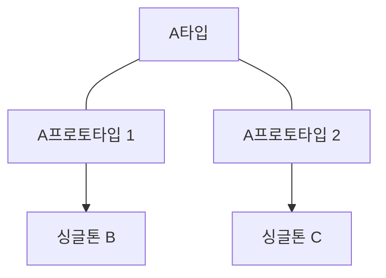

## 빈 스코프

빈이 존재할 수 있는 범위(생명주기)를 뜻 함

- 싱글톤: 기본 값, 스프링 컨테이너와 생명주기가 같음
- 프로토타입: 스프링 컨테이너가 객체 생성 초기화만 담당하고 이후는 클라이언트가 관리
- 웹 관련 스코프
  - request: 웹 요청이 들어오고 나갈때 까지 유지되는 스코프
  - session: 웹 세션이 생성되고 종료될 때 까지 유지되는 스코프

### 프로토 타입 스코프

스프링 컨테이너에서 프로토 타입 빈을 요청할 때마다 새로 객체를 생성, 의존관계 주입, 초기화해 클라이언트에게 전달한다. 즉 매 요청마다 전부 다른 객체를 클라이언트에게 전달한다.

```java
@Test
void prototypeTest() {
    AnnotationConfigApplicationContext ac = new AnnotationConfigApplicationContext(PrototypeBean.class);

    PrototypeBean bean1 = ac.getBean(PrototypeBean.class);
    PrototypeBean bean2 = ac.getBean(PrototypeBean.class);

    System.out.println("프로토타입 빈1 = " + bean1);
    System.out.println("프로토타입 빈2 = " + bean2);
    
    assertThat(bean1).isNotEqualTo(bean2);
    ac.close();
}

@Scope("prototype")
static class PrototypeBean {

    @PostConstruct
    public void init() {
        System.out.println("SingletonBean.init");
    }

    @PreDestroy
    public void destroy() {
        System.out.println("SingletonBean.destroy");
    }
}
```

프로토타입 빈으로 사용하려는 클래스에 `@Scope("prototype")`를 넣어주면 스프링 컨테이너에서 가져올때 프로토타입 빈을 반환한다.

프로토타입 빈 특징

- 스프링 컨테이너에 매 요청마다 새로 생성해 전달(이렇게 생성된 객체는 다 다른 객체다.)
- 스프링 컨테이너에 생성, 초기화까지만 관여하고 이후 클라이언트에게 전달
- 클라이언트가 관리하게 되서 `@PreDestroy`가 동작하지 않음, 클라이언트가 직접 해야함

### 싱글톤, 프로토타입을 함께 쓰면 생기는 문제

싱글톤 빈에 프로토타입 빈을 주입하게 되면 싱글톤 빈을 여러번 호출해도 싱글톤 빈 내부의 프로토타입 빈은 같다.

1. 싱글톤 빈이 생성 시점에 프로토타입 빈이 주입된다.
2. 싱글톤 빈이 스프링 컨테이너에 존재한다.
3. 해당 싱글톤 빈에는 처음 주입된 프로토타입 빈이 그대로인 상태다.
4. 싱글톤 빈을 여러번 호출해도 싱글톤 빈 내부의 프로토타입 빈은 바뀌지 않는다.

```java
@Test
void singletonPrototypeTest() {
    AnnotationConfigApplicationContext ac = new AnnotationConfigApplicationContext(Singleton.class, Counter.class);
    Singleton bean1 = ac.getBean(Singleton.class);
    Singleton bean2 = ac.getBean(Singleton.class);

    bean1.count();
    bean2.count();

    assertThat(bean1.getCount()).isEqualTo(2);
    assertThat(bean2.getCount()).isEqualTo(2);
}


static class Singleton {

    @Autowired
    private Counter counter;

    public void count() {
        counter.count();
    }

    public int getCount() {
        return counter.getCount();
    }

}

@Scope("prototype")
static class Counter {
    private int count = 0;

    public void count() {
        this.count += 1;
    }
    public int getCount() {
        return count;
    }
}
```

> 프로토타입 A가 B, C에 주입된다면 각각 다른 프로토타입 빈이 주입된다.



### 프로토타입, 싱글톤 함께 사용시 Provider로 문제 해결

싱글톤 빈에 특정 함수 사용할 때마다 다른 프로토타입을 이용하는 방법

#### 싱글톤 빈 내부에 스프링 컨테이너를 넣기

싱글톤 빈에서 함수 호출마다 스프링 컨테이너에서 새로 받아 사용한다. 스프링 컨테이너에 종속적이고 스프링 컨테이너의 기능을 오용할 가능성이 높다.

```java
@Test
void singletonPrototypeTest() {
    AnnotationConfigApplicationContext ac = new AnnotationConfigApplicationContext(Singleton.class, Counter.class);
    Singleton bean1 = ac.getBean(Singleton.class);
    Singleton bean2 = ac.getBean(Singleton.class);

    assertThat(bean1.count()).isEqualTo(1);
    assertThat(bean2.count()).isEqualTo(1);
}


static class Singleton {
    @Autowired
    AnnotationConfigApplicationContext ac;

    public int count() {
        Counter bean = ac.getBean(Counter.class);
        bean.count();
        return bean.getCount();
    }

}

@Scope("prototype")
static class Counter {
    private int count = 0;

    public void count() {
        this.count += 1;
    }
    public int getCount() {
        return count;
    }
}
```

Singleton.count()는 의존관계를 외부에서 주입이 아닌 메서드 내부에서 필요한 의존관계를 찾아 사용한다. Dependency Lookup(DL)이라고 한다.

#### ObjectFactory, ObjectProvider

ObjectFactory, ObjectProvider는 지정한 빈을 컨테이너에서 대신 찾아준다. 과거에는 ObjectFactory사용했고 편의 기능을 추가해 ObjectProvider가 만들어졌다.

```java
static class Singleton {
    @Autowired
    private ObjectProvider<Counter> counterObjectProvider;

    public int count() {
        Counter bean = counterObjectProvider.getObject();
        bean.count();
        return bean.getCount();
    }

}
```

ObjectProvider는 스프링 컨테이너보다 기능이 적어 모킹으로 테스트하기 쉽다.

ObjectFactory, ObjectProvider 둘 다 스프링에 의존한다.

#### JSR-330 Provider

스프링이 아난 자바 표준이다.

gradle에 'jakarta.inject:jakarta.inject-api:2.0.1' 의존성 추가를 해줘야 한다.

```java
static class Singleton {
    @Autowired
    private Provider<Counter> provider;

    public int count() {
        Counter bean = provider.get();
        bean.count();
        return bean.getCount();
    }

}
```

다른 컨테이너에서도 쓸 수 있다. 그러나 스프링 컨테이너가 고정이라면 스프링이 제공하는 기능을 사용하면 된다.
