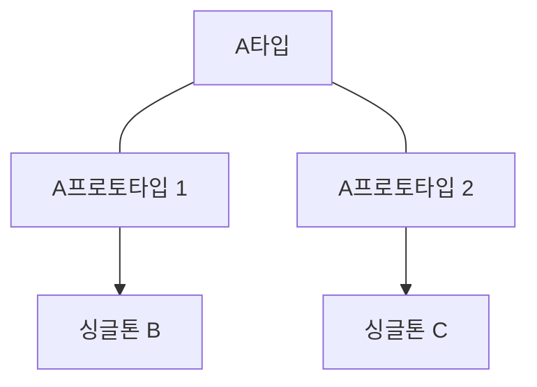

## 빈 스코프

빈이 존재할 수 있는 범위(생명주기)를 뜻 함

- 싱글톤: 기본 값, 스프링 컨테이너와 생명주기가 같음
- 프로토타입: 스프링 컨테이너가 객체 생성 초기화만 담당하고 이후는 클라이언트가 관리
- 웹 관련 스코프
  - request: 웹 요청이 들어오고 나갈때 까지 유지되는 스코프
  - session: 웹 세션이 생성되고 종료될 때 까지 유지되는 스코프

### 프로토 타입 스코프

스프링 컨테이너에서 프로토 타입 빈을 요청할 때마다 새로 객체를 생성, 의존관계 주입, 초기화해 클라이언트에게 전달한다. 즉 매 요청마다 전부 다른 객체를 클라이언트에게 전달한다.

```java
@Test
void prototypeTest() {
    AnnotationConfigApplicationContext ac = new AnnotationConfigApplicationContext(PrototypeBean.class);

    PrototypeBean bean1 = ac.getBean(PrototypeBean.class);
    PrototypeBean bean2 = ac.getBean(PrototypeBean.class);

    System.out.println("프로토타입 빈1 = " + bean1);
    System.out.println("프로토타입 빈2 = " + bean2);
    
    assertThat(bean1).isNotEqualTo(bean2);
    ac.close();
}

@Scope("prototype")
static class PrototypeBean {

    @PostConstruct
    public void init() {
        System.out.println("SingletonBean.init");
    }

    @PreDestroy
    public void destroy() {
        System.out.println("SingletonBean.destroy");
    }
}
```

프로토타입 빈으로 사용하려는 클래스에 `@Scope("prototype")`를 넣어주면 스프링 컨테이너에서 가져올때 프로토타입 빈을 반환한다.

프로토타입 빈 특징

- 스프링 컨테이너에 매 요청마다 새로 생성해 전달(이렇게 생성된 객체는 다 다른 객체다.)
- 스프링 컨테이너에 생성, 초기화까지만 관여하고 이후 클라이언트에게 전달
- 클라이언트가 관리하게 되서 `@PreDestroy`가 동작하지 않음, 클라이언트가 직접 해야함

### 싱글톤, 프로토타입을 함께 쓰면 생기는 문제

싱글톤 빈에 프로토타입 빈을 주입하게 되면 싱글톤 빈을 여러번 호출해도 싱글톤 빈 내부의 프로토타입 빈은 같다.

1. 싱글톤 빈이 생성 시점에 프로토타입 빈이 주입된다.
2. 싱글톤 빈이 스프링 컨테이너에 존재한다.
3. 해당 싱글톤 빈에는 처음 주입된 프로토타입 빈이 그대로인 상태다.
4. 싱글톤 빈을 여러번 호출해도 싱글톤 빈 내부의 프로토타입 빈은 바뀌지 않는다.

```java
@Test
void singletonPrototypeTest() {
    AnnotationConfigApplicationContext ac = new AnnotationConfigApplicationContext(Singleton.class, Counter.class);
    Singleton bean1 = ac.getBean(Singleton.class);
    Singleton bean2 = ac.getBean(Singleton.class);

    bean1.count();
    bean2.count();

    assertThat(bean1.getCount()).isEqualTo(2);
    assertThat(bean2.getCount()).isEqualTo(2);
}


static class Singleton {

    @Autowired
    private Counter counter;

    public void count() {
        counter.count();
    }

    public int getCount() {
        return counter.getCount();
    }

}

@Scope("prototype")
static class Counter {
    private int count = 0;

    public void count() {
        this.count += 1;
    }
    public int getCount() {
        return count;
    }
}
```

> 프로토타입 A가 B, C에 주입된다면 각각 다른 프로토타입 빈이 주입된다.



### 프로토타입, 싱글톤 함께 사용시 Provider로 문제 해결

싱글톤 빈에 특정 함수 사용할 때마다 다른 프로토타입을 이용하는 방법

#### 싱글톤 빈 내부에 스프링 컨테이너를 넣기

싱글톤 빈에서 함수 호출마다 스프링 컨테이너에서 새로 받아 사용한다. 스프링 컨테이너에 종속적이고 스프링 컨테이너의 기능을 오용할 가능성이 높다.

```java
@Test
void singletonPrototypeTest() {
    AnnotationConfigApplicationContext ac = new AnnotationConfigApplicationContext(Singleton.class, Counter.class);
    Singleton bean1 = ac.getBean(Singleton.class);
    Singleton bean2 = ac.getBean(Singleton.class);

    assertThat(bean1.count()).isEqualTo(1);
    assertThat(bean2.count()).isEqualTo(1);
}


static class Singleton {
    @Autowired
    AnnotationConfigApplicationContext ac;

    public int count() {
        Counter bean = ac.getBean(Counter.class);
        bean.count();
        return bean.getCount();
    }

}

@Scope("prototype")
static class Counter {
    private int count = 0;

    public void count() {
        this.count += 1;
    }
    public int getCount() {
        return count;
    }
}
```

Singleton.count()는 의존관계를 외부에서 주입이 아닌 메서드 내부에서 필요한 의존관계를 찾아 사용한다. Dependency Lookup(DL)이라고 한다.

#### ObjectFactory, ObjectProvider

ObjectFactory, ObjectProvider는 지정한 빈을 컨테이너에서 대신 찾아준다. 과거에는 ObjectFactory사용했고 편의 기능을 추가해 ObjectProvider가 만들어졌다.

```java
static class Singleton {
    @Autowired
    private ObjectProvider<Counter> counterObjectProvider;

    public int count() {
        Counter bean = counterObjectProvider.getObject();
        bean.count();
        return bean.getCount();
    }

}
```

ObjectProvider는 스프링 컨테이너보다 기능이 적어 모킹으로 테스트하기 쉽다.

ObjectFactory, ObjectProvider 둘 다 스프링에 의존한다.

#### JSR-330 Provider

스프링이 아난 자바 표준이다.

gradle에 'jakarta.inject:jakarta.inject-api:2.0.1' 의존성 추가를 해줘야 한다.

```java
static class Singleton {
    @Autowired
    private Provider<Counter> provider;

    public int count() {
        Counter bean = provider.get();
        bean.count();
        return bean.getCount();
    }

}
```

다른 컨테이너에서도 쓸 수 있다. 그러나 스프링 컨테이너가 고정이라면 스프링이 제공하는 기능을 사용하면 된다.

### 웹 스코프

웹 스코프는 웹 환경에서만 동작하고 해당 빈의 종료 메서드 호출이 가능하다.

웹 스코프 종류

- request
- session
- application
- websocket

request 웹 스코프는 클라이언트의 요청이 시작 될 때 생성되고 요청이 끝날 때 소멸된다.

```java
@Controller
@RequiredArgsConstructor
public class WebController {

    private final WebService webService;
    private final WebLogger webLogger;

    @RequestMapping("log-demo")
    @ResponseBody
    public String log(HttpServletRequest request) {
        String requestURL = request.getRequestURL().toString();
        webLogger.setRequestURL(requestURL);

        webLogger.log("컨트롤러 테스트");
        webService.logic("testId");
        return "OK";
    }
}
```

```java
@Component
@RequiredArgsConstructor
public class WebService {

    private final WebLogger webLogger;

    public void logic(String id) {
        webLogger.log("서비스 아이디 : " + id);
    }
}
```

```java
@Component
@Scope(value = "request") // 스코프가 request 이므로 웹 요청 하나당 한개의 webLogger 빈이 스프링 컨테이너에서 생성됨 요청이 종료되면 소멸
public class WebLogger {

    private String uuid;
    private String requestURL;

    public void setRequestURL(String requestURL) {  // 생성, 초기화 시점에 url을 알 방법이 없어 setter설정
        this.requestURL = requestURL;
    }

    public void log(String message) {
        System.out.println("[" + uuid + "] " + requestURL + " " + message);
    }

    @PostConstruct
    public void init() {
        this.uuid = UUID.randomUUID().toString();
        System.out.println("[" + uuid + "] request scope 빈 생성 :" + this);
    }

    @PreDestroy
    public void close() {
        System.out.println("[" + uuid + "] request scope 빈 소멸:" + this);
    }

}
```

```text
org.springframework.beans.factory.UnsatisfiedDependencyException: Error creating bean with name 'webController' defined in file [/Users/gimjuyeon/Documents/spring-basic/core/out/production/classes/hello/core/scope/WebController.class]: Unsatisfied dependency expressed through constructor parameter 0: Error creating bean with name 'webService' defined in file [/Users/gimjuyeon/Documents/spring-basic/core/out/production/classes/hello/core/scope/WebService.class]: Unsatisfied dependency expressed through constructor parameter 0: Error creating bean with name 'webLogger': Scope 'request' is not active for the current thread; consider defining a scoped proxy for this bean if you intend to refer to it from a singleton ...
```

이러한 예외가 발생하는 이유는 WebLogger는 request 스코프를 가진 빈이기 때문이다.

클라이언트가 요청을 할 때 생성되는 빈이기 때문에 스프링 컨테이너에서 다른 빈이 생성될 때 WebLogger빈은 생성되지 않아 문제가 발생한다.

### 스코프와 Provider

이런 문제를 DL을 통해 해결할 수 있다. ObjectProvider를 이용해 메서드 호출시점까지 request 스코프 빈의 생성을 지연시켜 문제를 해결했다.

WebController, WebService에서 각각 WebLogger를 호출해도 같은 빈이 호출된다.

```java
@Controller
@RequiredArgsConstructor
public class WebController {

    private final WebService webService;
    private final ObjectProvider<WebLogger> webLoggerProvider;

    @RequestMapping("log-demo")
    @ResponseBody
    public String log(HttpServletRequest request) {
        String requestURL = request.getRequestURL().toString();
        WebLogger webLogger = webLoggerProvider.getObject();
        webLogger.setRequestURL(requestURL);

        webLogger.log("컨트롤러 테스트");
        webService.logic("testId");
        return "OK";
    }
}
```

```java
@Component
@RequiredArgsConstructor
public class WebService {

    private final ObjectProvider<WebLogger> webLoggerProvider;

    public void logic(String id) {
        WebLogger webLogger = webLoggerProvider.getObject();
        webLogger.log("서비스 아이디 : " + id);
    }
}
```

### 스코프와 프록시

프록시 방식을 이용하면 더 간략하게 코드를 줄일 수 있다.

Controller와 Service 둘 다 ObjectProvider를 사용하기 이전으로 돌려놓고 WebLogger의 Scope 어노테이션을 아래와같이 수정하면 해결된다.

```java
@Component
@Scope(value = "request", proxyMode = ScopedProxyMode.TARGET_CLASS )
public class WebLogger {
```

Scope 어노테이션 proxyMode에 값을 넣어주면 된다. 대상이 클래스면 TARGET_CLASS 인터페이스면 INTERFACES를 선택한다.

이렇게 설정하면 프록시인 가짜 WebLogger가 만들어져 다른 빈에 주입 가능하다.

### 웹 스코프와 프록시 동작 원리

주입된 빈을 확인해 보면 CGLIB 라이브러리로 WebLogger를 상속받은 가짜 프록시 객체임을 확인할 수 있다.

@Scope에서 proxyMode=ScopedProxyMode.TARGET_CLASS 이면 스프링 컨테이너는 CGLIB를 이용해 WebLogger를 상속받은 가짜프록시 객체를 생성하고 스프링 컨테이너에 webLogger라는 이름으로 프록시 객체를 등록한다.

빈의 의존관계에서 이 가짜 프록시가 주입된다.

가짜 프록시 객체에 호출이 발생하면 내부에서 진짜 빈에게 요청한다. 즉 껍데기만 쓰고 외부 요청과 진짜 빈의 연결 역할을 수행한다.

가짜 프록시 객체는 싱글톤처럼 동작한다. 싱글톤처럼 사용하지만 다르게 동작하기 때문에 주의를 기울여야한다.
