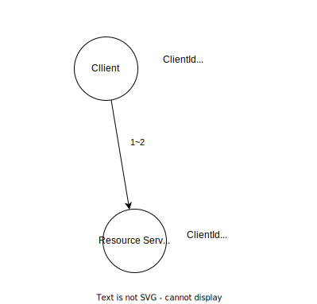

## OAuth

사용자의 다른 서비스와 연도아형 서비스를 이용하고 싶음

사용자의 ID PW는 보안상 위험 대신 연동 서비스에서 accessToken을 발급, 나의 서비스는 해당 토큰을 이용하여 연동 서비스와 연결

### 참여자

- Resource Owner(사용자)
- Client(서비스)
- Resource Server(연동서비스)

### 과정

#### Resource Server에 Client등록

Client가 Resorce Server를 이용하기 위해 등록과정을 거침

1. Resource Server에게 ClientId, ClientSceret, Autorized redirect URL을 전송
2. Resource Server는 해당 내용을 기억

#### Resource Owner의 Client 접속

1. Resource Owner가 Client에 접속
2. Client가 연동 서비스 로그인 요구
3. Resource Owner는 연동 서비스 접속
4. Resource Server가 Resource Owner의 로그인 여부 확인
5. Resource Owner로그인
6. Resource Owner이 접속하려는 서비스의 ClientId, redirectURL확인, 스코프에 대한 허용 물음
7. Resource Owner의 확인으로 해당 내용을 Resource Server에 저장

#### Resource Owner, Client, Resource Server 인증

1. Resource Server가 authorization code를 포합한 Client URL로 리다이렉트 요청
2. Resource Owner는 Client로 리다이렉트
3. Client는 요청에 있는 authorization code를 저장
4. Client가 Client와 Resource Owner의 정보를 담아 Resource Server로 인증 요청

#### AccessToken 발급

Resource Server는 해당 정보를 받고 Client에게 AccessToken 발급

- 해당 토큰을 이용하여 REST API에 요청
  - 헤더에 AccessToken을 넣어 요청(표준, 안전한 방식)
  - URL에 파라미터로 요청

#### AccessToken 만료

AccessToken은 만료기한이 있어 지속적인 사용이 불가하다.

RefreshToekn으로 AccessToekn 재발급 또는 AccessToken, RefreshToken 재발급이 가능하다.
