# 도커 <!-- omit in toc -->

여러 개발자의 개발환경과 배포환경 등을 쉽게 관리하기 위해 나온 것이 도커 입니다.

- [기본 개념](#기본-개념)
  - [호스트](#호스트)
  - [컨테이너](#컨테이너)
- [설치](#설치)
- [Docker Hub](#docker-hub)
- [기본적인 명령어](#기본적인-명령어)
  - [pull](#pull)
  - [image](#image)
  - [run](#run)
  - [stop](#stop)
  - [ps](#ps)
  - [rm](#rm)
  - [rmi](#rmi)
- [네트워크 (포트 포워딩)](#네트워크-포트-포워딩)
  - [run -p](#run--p)
- [컨테이너에서 명령어 실행](#컨테이너에서-명령어-실행)
- [호스트 컨테이너 파일시스템 연결](#호스트-컨테이너-파일시스템-연결)

## 기본 개념

도커는 컨테이너라는 격리된 환경을 제공하는데, 이 격리된 공간에서 프로그램을 실행합니다.



### 호스트

호스트는 운영체제가 설치된 컴퓨터를 의미합니다.

### 컨테이너

컨테이너는 호스트와 격리된 각각의 실행환경을 말합니다.

컨테이너 기술은 리눅스 운영체제의 기술입니다. 이 기술을 이용하면 가상 운영체제 설치, 저장장치 용량, 성능면에서 이점이 있습니다.

리눅스가 아닌 MacOS, 윈도우 운영체제를 사용한다면 리눅스를 설치하고 그 위에서 동작합니다. 어느정도의 성능저하가 일어납니다.

## 설치

- [Homebrew docker 페이지](https://formulae.brew.sh/cask/docker)
- [docker 공식 홈페이지](https://www.docker.com)

도커는 CLI, GUI 환경을 제공합니다. 필요에 맞게 사용하면 됩니다. 단 리눅스 환경에서는 GUI를 지원하지 않습니다.

## Docker Hub



Docker Hub에서 이미지를 다운로드 받는 것을 pull, 실행하는 것을 run 이라고 합니다.

앱스토어에서 프로그램을 받고 실행하여 프로세스가 생성되는 것 처럼 docker hub에서 이미지를 받고 실행하여 컨테이너가 생성됩니다.

## 기본적인 명령어

도커에서 사용되는 기본적인 명령어를 다룹니다.

### pull

```shell
docker pull 이미지 이름
```

### image

docker hub에서 설치한 이미지들을 보여줍니다.

```shell
docker images
```

### run

이미지의 내용을 불러와 컨테이너를 생성하여 실행합니다.

```shell
docker run --name 이름 httpd
```

### stop

실행중인 컨테이너를 중단합니다.

```shell
docker stop 이름
```

### ps

현재 실행 중인 컨테이너들을 보여줍니다.

```shell
docker ps
```

중단된 컨테이너를 포함한 모든 컨테이너를 보여줍니다.

```shell
docker ps -a
```

### rm

컨테이너를 삭제합니다.

```shell
docker rm 컨테이너 이름
```

### rmi

이미지를 삭제합니다.

```shell
docker rmi 이미지 이름
```

## 네트워크 (포트 포워딩)



### run -p

`-p`옵션을 이용하여 호스트와 컨테이너 간 포트 포워딩이 가능합니다.

```shell
docker run -p 호스트_포트:컨테이너_포트 이미지
```

## 컨테이너에서 명령어 실행

컨테이너에서 명령어를 실행합니다. 하지만 명령어를 실행한 이후 연결이 끊어집니다.

```shell
docker exec 이름 명령어
```

다음 명령어를 사용하면 연결이 끊기지 않고 터미널로 컨테이너 내부를 조작할 수 있습니다.

`-it`옵션은 지속적인 연결, `/bin/sh`은 쉘을 의미합니다.

```shell
docker exec -it 이름 /bin/sh
```

## 호스트 컨테이너 파일시스템 연결

호스트와 컨테이너간 파일시스템을 연결하여 컨테이너가 사라져도 소스코드는 유지할 수 있는 방법이 있습니다.



옵션 `-v`는 Volum을 뜻합니다.

```shell
docker run -v 호스트_경로:컨테이너_경로 이미지
```
