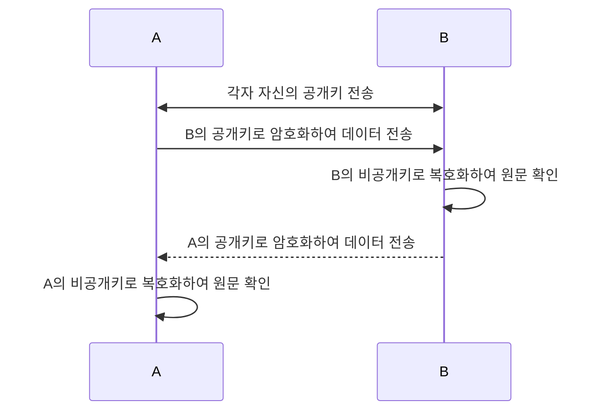

# 암호

- 단방향(MD5, SHA(hash))
- 양방향
  - 대칭(AES, Twofish)
  - 비대칭(공개키 비공개키, RSA)

## 단방향 암호화

단방향 암호화는 복호화가 불가능한 암호화입니다.(해싱)

## 양방향 암호화

양방향 암호화는 복호화가 가능한 암호화입니다.

### 대칭키

대칭키는 하나의 키를 사용하여 암호화, 복호화합니다.

### 비대칭키(공개키, 비공개키)

비대칭키(키페어)는 서로 다른 2개의 키로 이루어져있습니다. 암호화와 복호화를 수행하기 위해서 서로 다른 키 2개가 필요하여 비대칭키입니다. 1번 키로 암호화된 데이터를 2번키로 복호화 가능하며 그 반대도 가능합니다.

모두에게 공개되는 키를 공개키로 설정하면 공개키를 이용하여 데이터를 암호화할 수 있습니다. 그리고 해당 데이터의 원문은 비공개키를 가진 사람만 볼 수 있습니다.

> 참고자료 
> [공개 키 암호화는 어떻게 작동할까요?](https://www.cloudflare.com/ko-kr/learning/ssl/how-does-public-key-encryption-work/) 
> [Public key encryption](https://www.ibm.com/docs/en/integration-bus/10.0?topic=overview-public-key-cryptography#ac55940___title__3)

<!-- TODO: 이해 못함

### 공개키, 비공개키를 이용한 전자서명

#### 전자서명 과정

1. B는 공개키를 공개 영역을 통해 A에게 전송
2. B는 비공개키와 데이터를 조합하여 암호화된 데이터를 A에게 전송
3. A는 B의 공개 데이터와, 공개키, 암호화된 데이터를 받음
4. A는 B의 공개키를 이용하여 암호화된 데이터를 복호화, B의 공개 데이터와 비교

-->