# 암호

컴퓨터에서 사용하는 암호 방식은 아래 그림과 같습니다.

## 단방향 암호화

단방향 암호화는 복호화가 불가능한 암호화입니다.

## 양방향 암호화

양방향 암호화는 복호화가 가능한 암호화입니다.

### 대칭키

대칭키는 하나의 키를 사용하여 암호화, 복호화합니다.

### 공개키, 비공개키

공개키, 비공개키를 키페어라고 부르며, 공개키로 암호화를 비공개키로 복호화를 수행합니다.

### 공개키, 비공개키의 암호화, 복호화 과정

1. 각자의 공개키를 공유하여 서로의 공개키를 소유
2. 각자 비공개 키와 데이터를 조합하여 암호화된 데이터 생성 후 전송
3. 1에서 공유한 공개키를 이용하여 복호화

### 공개키, 비공개키를 이용한 전자서명

<!-- TODO: 잘못 이해함-->

#### 전자서명 과정

1. B는 공개키를 공개 영역을 통해 A에게 전송
2. B는 비공개키와 데이터를 조합하여 암호화된 데이터를 A에게 전송
3. A는 B의 공개 데이터와, 공개키, 암호화된 데이터를 받음
4. A는 B의 공개키를 이용하여 암호화된 데이터를 복호화, B의 공개 데이터와 비교
