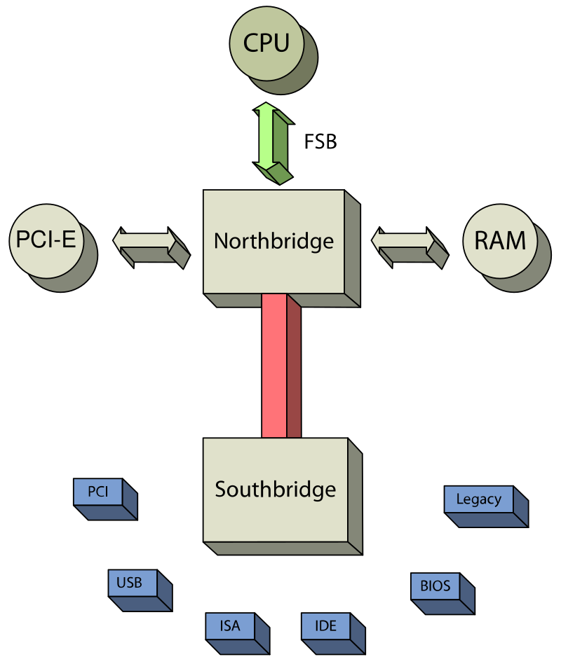

## 인터럽트

하던 일을 일시중단하고 **급하게 다른 일을 처리 후** 복귀하는 기능이다. 외부 인터럽트, 내부 인터럽트, 소프트웨어 인터럽트가 있다.

### 외부 인터럽트

- 전원 이상 인터럽트: 정전, 파워이상, 절전 모드
- 기계 착오 인터럽트: CPU 오동작
- 외부 신호 인터럽트
  - 타이머
  - 인터럽트 키 입력: ex) <kbd>ctrl</kbd> + <kbd>alt</kbd> + <kbd>del</kbd>
- IO 인터럽트
  - IO 데이터 전송 요청, IO 종료로 인한 인터럽트
  - IO 오류로 인한 인터럽트

### 내부 인터럽트

잘못된 명령, 잘못된 데이터를 사용할 때 발생한다.

- 프로그램 검사 인터럽트
  - Division by Zero
  - Overflow, Underflow
  - 기타 예외

### 소프트웨어 인터럽트(SuperVisor Call)

### 인터럽트 동작 순서

1. 인터럽트 요청
2. 프로그램 일시정지: CPU 연산 일시중지
3. 현재 프로그램 상태 보존: PCB(Program Control Block), PC(Program Counter) 백업
4. 인터럽트 처리루틴 실행: 인터럽트 요청 장치 식별
5. **인터럽트 서비스 루틴(ISR)** 실행
6. 상태복구
7. 중단된 프로그램 실행 재개

인터럽트가 발생하면 각 서비스의 Interrupt Service Routine(ISR)이 작동해서 완료될 때까지 프로그램 일시정지

## CPU RAM 매모리 매니저(브릿지)

옛날에는 CPU가 직접 RAM에 접근했지만 지금은 CPU가 메모리 매니저를 통해 RAM에 간접적으로 접근한다.

옛날에는 매모리 매니저(브릿지)가 메인보드에 있어서 메인보드에 따라 CPU 성능이 달라졌다.

브릿지에는 노스 브릿지, 사우스 브릿지가 있다. 노스 브릿지는 성능이 중요한 RAM, GPU(PCI-E)등을 담당하고 사우스 브릿지는 비교적 성능이 덜 중요한 것들을 담당한다.

결국 브릿지 칩셋(메인보드)에 따라 CPU 성능이 달라지자 CPU에 브릿지 칩셋을 넣었다.

## I/O 성능(DMA)

고성능 장치를 사용하면 비동기가 가능해서 성능이 좋아진다. 원래는 동기로 동작한다.

하드웨어에 접근하는 단계가 많을수록 성능은 감소한다. 그래서 유저모드 api와 커널을 하나로 만들어 성능을 높힐 수 있다. 이게 DirectX의 기능 중 하나이다.
