# 프로세스

프로세스는 컴퓨터에서 실행되는 프로그램입니다. 스레드는 프로세스 내 작업의 흐름입니다.

디스크에서 프로그램을 메모리에 올리면 프로세스가 됩니다. 이후 OS는 프로세스를 스케줄링 하게 됩니다. 프로그램은 컴파일 과정을 거쳐 기계어로 변환됩니다.

## 컴파일 과정

1. 전처리
2. 컴파일러
3. 어셈블러
4. 링커

### 전처리

주석 주석을 제거하고 헤더 파일을 병합합니다.

### 컴파일러

오류 처리 코드 최적화 코드 에샘블리어로 변환합니다.

### 어셈블러

목적 코드로 변환됩니다. 목적 코드는 운영 체제마다 다릅니다.

### 링커

프로그램 내에 라이브러리 함수 다른 목적 코드로 결합, 실행 파일을 생성합니다.

#### 정적 라이브러리

정적 라이브러리는 프로그램 빌드 시 라이브러리의 모든 코드가 실행 코드에 포함됩니다.

코드 중복, 메모리의 효율과 외부 환경 의존이 낮아집니다.

#### 동적 라이브러리

프로그램 실행 시 필요한 것만 참조하게 됩니다.

DLL이라는 함수 정보를 통해 참조합니다. 메모리의 효율성이 낮아지고 외부 의존도가 높아집니다.

## 프로세스 상태

### 생성 상태

생성 상태는 프로세스가 생성된 상태로 `fork()`, `exec()`를 통해 생성 PCB를 할당하게 됩니다.

- `fork()`는 부모 프로세스의 주소 공간을 복사하고 새로운 자식 프로세스를 생성합니다.
- `exec()`는 새로운 프로세스를 생성하는 생성 함수입니다.

### 대기 상태

대기 상태는 메모리 공간에 메모리 공간에 충분하면 메모리를 할당받고 아니면 대기 상태로 대기하게 됩니다. CPU 소유권이 넘어오기를 기다리게 됩니다.

### 대기 중단 상태

대기 중단 상태는 메모리 부족으로 일시 중단된 상태입니다.

### 실행 상태

실행 상태는 CPU 소유권을 할당받고 수행 중인 상태입니다.

### 중단 상태

중단 상태는 어떤 이벤트 발생 후 기다리며 프로세스가 차단된 상태로 주로 I/O 디바이스 인터럽트로 발생하게 됩니다.

### 일시 중단 상태

일시 중단 상태는 중단 상태에서 메모리가 부족한 상황입니다.

### 종료 단계

종료 단계는 메모리와 CPU의 소유권을 모두 놓고 가는 상태입니다.

## 프로세스의 메모리 구조

### 스텍

스텍은 지역 변수, 매개 변수, 함수가 저장되고 호출 시 크기가 동적으로 늘어납니다.

### 힙

힙은 동적 자료 구조, 동적 할당에 사용되므로 런타임에서 크기가 결정됩니다.

### 데이터 영역

데이터 영역은 정적 변수, 전역 변수가 들어가게 됩니다. BSS와 Data 영역으로 나뉩니다.

#### BSS

BSS영역은 초기화되지 않은 변수가 0으로 초기화되어 저장되게 됩니다.

#### Data

Data영역은 0이 아닌 값으로 할당된 변수들입니다.

### 코드 영역

코드 영역은 소스 코드의 영역 기계화로 되어 있으며 정적입니다.

## PCB

PCB는 운영 체제에서 프로세스에 대한 메타데이터를 저장하게 됩니다.

프로세스 생성 시 PCB를 생성하게 됩니다.

### 메타데이터

메타데이터는 데이터에 대한 정보를 기록한 데이터로 일정한 규칙을 가지고 있습니다.

### 컨텍스트 스위칭

> 컨텍스트 스위칭을 설명하기 위해서 싱글코어 CPU로 가정하고 설명합니다.

컨텍스트 스위칭은 PCB를 교환하는 과정입니다.

프로세스에 할당된 시간이 만료되거나 인터럽트 발생이 주 원인입니다. CPU는 프로세스를 동시에 실행하지 못합니다. 단 빠르게 프로세스를 교체하여 한 번에 여러 작업이 수행되는 것처럼 보일 수 있습니다.

컨텍스트 스위칭은 PCB를 교체함으로써 교체하는 시간이 소모되고, PCB가 교체되면서 해당 정보와 연결된 실제 데이터를 다시 캐싱해야 합니다. 이 과정에서 캐시 미싱이 발생하게 됩니다.

## 멀티프로세싱

멀티프로세싱은 여러 개의 프로세스, 멀티프로세스를 통해 동시에 두 가지 이상의 일을 수행하는 것을 말합니다.

이를 이용하여 하나 이상의 일을 병렬로 처리할 수 있으며 프로세스에 문제가 발생하게 되더라도 다른 프로세스를 사용하여 처리할 수 있습니다.

### IPC

IPC는 멀티프로세싱이 가능합니다.

IPC에는 공유 메모리, 파일 소켓, 익명 파이프, 명령 파이프 메시지 큐가 있습니다.

IPC는 프로세스 처리 데이터를 프로세스끼리 데이터를 주고 주고 받고 공유 데이터를 관리하는 메커니즘입니다.

#### 공유 메모리

공유 메모리는 여러 프로세스에서 동일한 메모리 블록에 대한 접근 권한이 부여되어 프로세스가 서로 통신할 수 있도록 공유 버퍼를 생성하는 것을 말합니다.

기본적으로 프로세스 내 메모리의 공유는 불가능합니다. 공유 메모리를 이용하면 하나의 공유 메모리를 통해 여러 프로세스가 하나의 메모리를 공유할 수 있습니다.

#### 소켓

소켓은 동일한 컴퓨터의 다른 프로세스나 네트워크에 대한 인터페이스를 통해 전송하는 데이터입니다.

## 스래드, 멀티 스래딩

### 스레드

스레드는 메모리 스레드는 프로세스에 실행 가능한 가장 작은 단위입니다.

프로세스는 여러 개의 스레드를 가질 수 있습니다.

스레드는 프로세스의 코드, 데이터, 힙을 공유합니다.

그 외에 나머지는 각각 생성됩니다.

### 멀티스레딩

멀티스레딩은 프로세스에서 여러 스레드로 작업을 수행하는 방법입니다.

스레드 간 일부 자원을 공유하기 때문에 효율성이 높습니다.
하지만 하나의 스레드에서 문제가 발생하면 다른 스레드에 영향을 줄 수 있습니다.

#### 동시성

동시성은 여러 작업을 동시에 처리하는 것을 의미하며 동시에 실행되는 것처럼 보이는 것입니다.

> **동시성 문제** 
> 일관성이 깨지는 문제로 데이터의 정합성이 깨지는 문제입니다. 공통 자원에 대하여 읽고 쓰는 작업을 통하여 데이터가 일관성이 일관적이지 못한 상황이 발생하는 것입니다.

## 공유 자원, 임계 영역

### 공유 자원

공유 자원은 시스템 안에서 각 프로세스 스레드가 함께 접근할 수 있는 자원 변수를 의미합니다.

#### 경쟁 상태

경쟁 상태는 공유 자원을 2개 이상의 프로세스가 동시에 읽거나 쓰는 상황입니다. 동시성 문제가 생길 수 있는 상태입니다.

### 임계 영역

임계 영역은 공유 자원에 접근한 순서 등의 이유로 결과가 달라지는 영역입니다.

해결 방법은 뮤텍스, 세마포어, 모니터가 있습니다. 이 방법 모두 상호 배제, 한정 대기, 융통성 조건을 만족합니다.

#### 상호 배제

상호 배제는 한 프로세스가 임계 영역에 들어갔을 때 다른 프로세스가 접근할 수 없습니다.

#### 한정대기

한정대기는 특정 프로세스가 영원히 임계 영역에 들어가지 못하면 안 됩니다.

#### 융통성

융통성은 한 프로세스가 다른 프로세스의 일을 방해하면 안 됩니다.

#### 뮤텍스

뮤텍스는 공유 자원을 사용 전에 잠금을 설정하고 사용 후에 해제합니다. 뮤텍스는 잠금과 잠금 해제 상태만 가집니다. 잠금이 설정되어 있으면 다른 스레드는 접근할 수 없습니다.

#### 세마포어

세마포어는 일반화된 뮤텍스입니다. 간단한 정수값과 두 가지 함수 웨이트와 시그널로 공유 자원에 대한 접근을 처리하게 됩니다.

- `wait()`는 대기, `signal()`은 다음 프로세스 순서를 넘겨주는 함수입니다.

#### 바이너리 세마포어

바이너리 세마포어는 0과 1 두 가지 값만 가질 수 있는 세마포어입니다. 전체적인 것은 세마포와 비슷합니다.

#### 카운팅 세마포어

카운팅 세마포어는 여러 개의 값을 가질 수 있는 세마포어입니다. 여러 자원에 대한 접근을 제어하는 세마포어입니다.

#### 모니터

모니터는 공유 자원을 숨기고 인터페이스만을 제공합니다.

모니터는 공유 자원을 안전하게 관리됩니다. 둘 이상의 프로세스나 쓰레드의 접근을 모니터 큐를 통해 공유 자원의 작업을 순서대로 처리합니다. 모니터는 자동 세마포어는 수동으로 작업해야 합니다.

## 교착 상태

교착 상태는 2개 이상의 프로세스가 서로 자원을 기다리며 중단된 상황입니다.

### 교착 상태의 원인

교착 상태의 원인으로는 상호 배제, 점유 대기, 비선점, 환영 대기가 있습니다.

#### 상호 배제

상호 배제는 한 프로세스가 자원을 독점, 다른 프로세스는 접근이 불가능한 상태를 의미합니다.

#### 점유 대기

점유 대기는 특정 프로세스가 점유한 자원을 다른 프로세스가 요청하는 상황입니다.

#### 비선점

비선점은 다른 프로세스의 자원을 선점할 수 없습니다.

#### 환형 대기

환영대기는 2개 이상의 프로세스가 서로의 자원을 요구하여 원 모양의 자원 대기가 발생하는 것을 말합니다.

### 교착 상태 해결 방법

- 자원 할당 시 조건이 성립 불가하도록 설계
- 교착상태 가능성이 없을 때만 자원 할당, 은행원 알고리즘 사용
- 교착상태 발생시 사이클을 찾고 관련 프로세스를 지움

> **은행원 알고리즘** 
> 프로세스당 요청할 자원들의 최대치를 통해 자원 할당 가능 여부를 파악하는 알고리즘
