# 웹 서버 프로그램

유명한 웹 서버 프로그램으로 `아피치`, `Nginx`가 있습니다.

## WAS 서버

Spring, nodejs/express, php 와 같은 서버 프레임 워크들은 아파치, Nginx를 함께 쓰기도 합니다.

이 때 Spring, nodejs/express, php를 WAS (Web Application Server)라고 부릅니다.

`아피치`, `Nginx`와 같은 웹 서버 프로그램은 단순 처리를 담당하고 WAS는 복잡한 동적 처리를 합니다.

### 이유

- 역할 분담
- 리버스 프록시
- 로드 밸런싱

역할 분담의 측면에서 보면 웹 서버 프로그램은 https/http 요청을 담당하고
뒤에있는 서버 프레임 워크는 사용자의 요청을 처리합니다.

리버스 프록시는 사용자의 요청을 처리하는 서버가 직접 노출되는 것이 아닌 중간에 웹 서버 프로그램을 거치면서 보안적 측면에서의 이점을 확보할 수 있습니다.

로드 밸런싱은 서버 프로세스가 다수인 경우 웹 서버 프로그램은 다수의 서버 프로세스에 균등한 부하를 줌 으로써 시스템을 보다 안정적으로 운영할 수 있습니다.

### 예시

